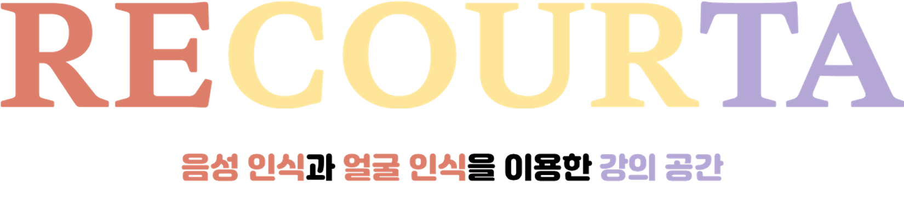

# I. 서비스 소개

---

## 1. 서비스 설명

### 개요

- 한줄 소개 : 음성 인식과 얼굴 인식을 통해 강의자와 수강생 모두가 만족할 수 있는 온라인 화상 강의실 제공
- 서비스명 : RECOURTA(Recognition Course Ta-da)

### 타겟

- 출결 관리에 어려움을 겪거나 양질의 강의를 제공하고 싶은 강의자
- 집중하기 어려운 온라인 수업 환경에서 보다 나은 수업 환경을 원하는 수강생

## 2. 기획 배경

### 배경

기존의 서비스는 부정 출결을 방지하기가 어려웠습니다. 또한 수업을 진행할 때 네트워크 상태가 불안정해 강의자의 소리가 끊겨서 들리는 등 수강생 본인의 노력과 의지에 상관없이 수업에 집중하기 힘들어지는 문제점도 있었습니다. 이처럼 온라인 화상 수업에서 어려움을 겪는 강의자 및 수강생에게 조금이라도 도움을 주기 위해 ‘RECOURTA’를 만들었습니다. 

# II. 기술 스택

---

## 1. 개발 환경

---

🖥️ **backend**

- Intellij 2021.1.3
- SpringBoot 2.7.1
- spring-boot-jpa
- SpringSecurity
- Java 8
- MySQL 5.7
- Redis

🖥️ **frontend**

- Visual Studio Code 1.70.0
- Vue3 3.2.37 / Vite 3.0.3
- Vuex 4.0.2
- Vue Router 4.0.13
- Tailwind CSS 3.1.6 / Tailwind Elements 1.0.0-alpha12

🖥️ **Web RTC**

- Openvidu 2.22.0
- Openvidu-browser 2.22.0

🖥️ **API**

- [face-api](https://github.com/vladmandic/face-api)
- [Web Speech API](https://developer.mozilla.org/en-US/docs/Web/API/Web_Speech_API)

🖥️ **Deployment**

- Ubuntu 20.04LTS
- docker
- jenkins
- nginx

## 2. 서비스 아키텍처

---

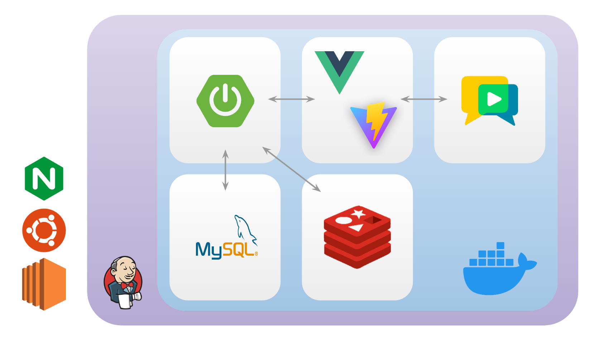

## 3. 배포

---

- Https 인증서 발급
    - 인증서 발급을 위해 certbot을 활용하였습니다.
    - [recourta.ga](http://recourta.ga) 도메인에 대하여 적용하여 주소창에 해당 주소만 입력해도 https로 리다이렉트 되도록 설정하였습니다.
- Nginx 포트 설정: 80
- 컨테이너 포트 설정
    - Frontend : 3715
    - Backend : 8081
    - Openvidu : 4443
    - Mysql : 3306
    - Redis : 6379
- OpenVidu 포트 설정
    - Openvidu는 별도의 설정파일(`.env`) 파일이 존재하여, SSL 인증서 및 포트 설정을 추가로 해주었습니다.
- 자동 빌드 설정
    - Jenkins를 구축하여 `master`브랜치에 push가 일어나는 경우 자동으로 배포가 이루어지도록 하였습니다.
    - push 이벤트 발생 시 자동으로 Frontend / Backend 컨테이너를 빌드하고, 빌드 완료 시 기존의 컨테이너를 대체하도록 설정하였습니다.

# III. 기능 소개

---

## 1. 구현 기술 목록

---

### **회원 관리**

1. 회원 가입
    1. 아이디 중복 체크 및 비밀번호 유효성 검사
    2. 프로필 사진 찍기 및 저장 (얼굴 인식용)
    3. 강의자와 수강자로 구분
    4. 이메일 인증 : 이메일로 인증 코드 전송 후 일치 여부 확인, 인증 유효 시간 설정
2. 로그인
    1. JWT (access /refresh token) 사용
    2. 비밀번호 찾기 : 이메일로 전송된 링크를 통해 비밀번호 재설정, 재설정 링크 유효 시간 설정
3. 마이 페이지
    1. 회원 정보 조회 가능
    2. 이미지 변경 기능 구현
    3. 비밀번호 변경 기능 구현
    4. 회원 탈퇴 기능 구현
        - 강의자가 탈퇴할 경우
            - 현재 강의 중인 수업이 있을 경우 강의 종강일을 강의자 탈퇴 날짜로 변경 후 종강 처리
            - 아직 강의가 시작되지 않았을 경우 강의 정보 삭제

### **강의 관리**

1. 강의 CRUD : 강의 제목, 강의 내용, 강의 시간, 강의 썸네일 이미지 등 지정 가능
2. 세션 자동 CRUD
    1. 강의 생성 시 회차별 수업 세션 (1회차 수업, 2회차 수업 등) 정보 자동 생성
    2. 개강 이후 강의 시간 수정 시 세션 정보도 함께 업데이트
3. 검색 기능
    1. 신청 가능한 강의 검색 가능
    2. 강의자/강의명 검색 가능
4. 강의 목록 조회 : 신청 가능한 강의, 이전에 들었던 강의, 자신이 개설한 강의 등 조회 가능

### **강의실**

1. 화상 수업
    1. 카메라 / 마이크 공유
    2. 다른 사람의 카메라, 마이크 ON/OFF
    3. 강제 퇴장
2. 화면 공유
    1. 강의자가 권한 부여 시 화면 공유 가능
3. 실시간 자막 기능
    1. 마이크 활성화 시 STT를 이용하여 말한 내용을 자막으로 변환
    2. ON / OFF 가능
4. 강의록 제공
    1. 텍스트 파일로 된 강의록 제공
    2. 자바스크립트 변수를 파일로 변환하여 강의실 퇴장 시 강의록 텍스트 파일 다운 가능
5. 출석 체크
    1. tensorflow를 활용한 얼굴인식 API를 적용하여 대리 출석 방지
    2. 얼굴 인식 불가 시 타이머 작동 ⇒ 일정 시간 이상 자리 비움 시 자동으로 결석 전환
6. 입퇴실 기록을 통한 자동 출석부
7. 채팅
    1. 대상자 지정 가능(귓속말)
8. 참가자 온/오프라인 여부 확인

## 2. 기술 특이점 (핵심 기술)

---

- face-api를 활용한 수강자 얼굴 분석
- Speech Recognition을 이용한 STT(Speech-To-Text) 기능 구현

## 3. 특장점 (독창적인 기술)

---

- 수강자 얼굴 분석을 통한 출결 관리(대리 출석 방지, 자리 비움 확인)
- STT 기능을 활용한 실시간 자막 및 강의록 제공
- 강의실 입/퇴장 로그를 활용한 자동 출결 관리
- 온라인 화상 수업 맞춤 플랫폼 개발

# IV. 서비스 화면

---

## 1. 화면 소개

---

### 회원 관리

---

### 회원 가입

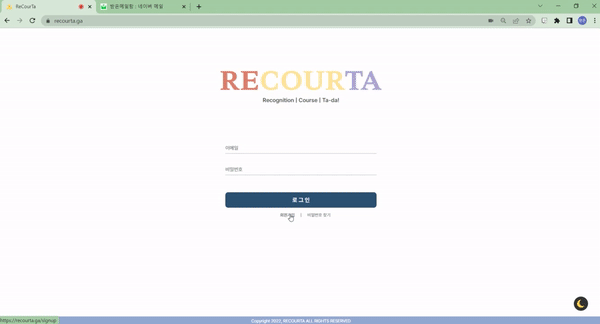

### 로그인

 

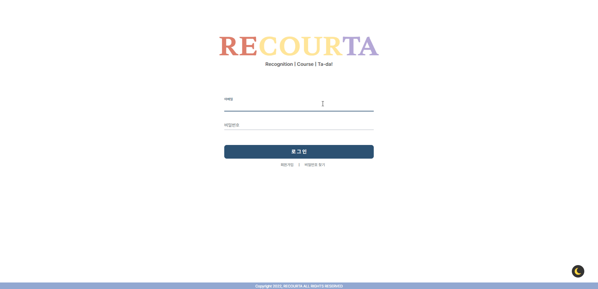

### 로그아웃

### 비밀번호 변경

### 프로필 이미지 변경

- 변경 성공

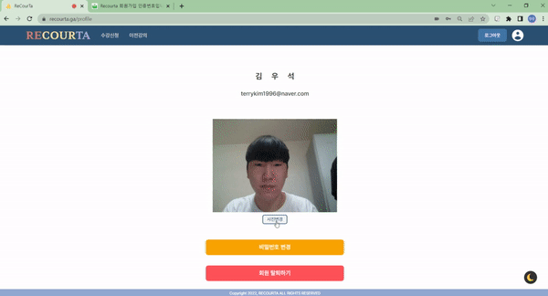

- 변경 실패

### 비밀번호 찾기

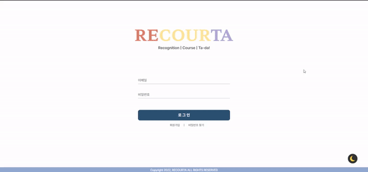

### 회원 탈퇴

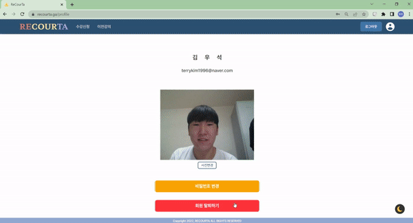

### 강의 관리

---

### 강의 생성

### 강의 정보 수정

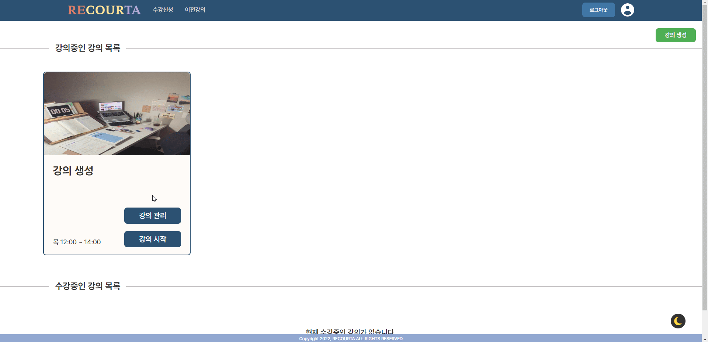

### 강의 폐쇄

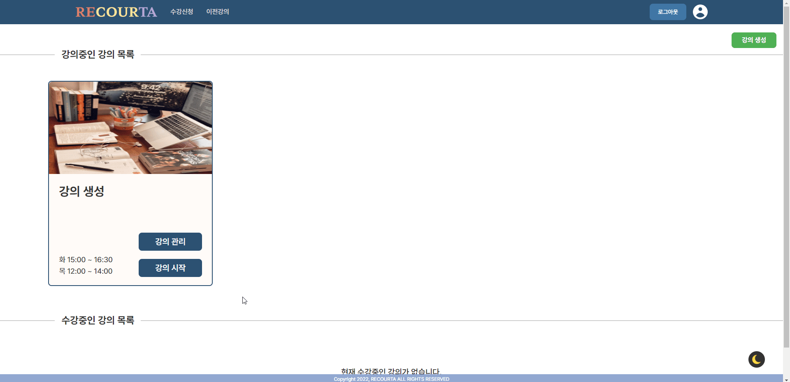

### 출석부

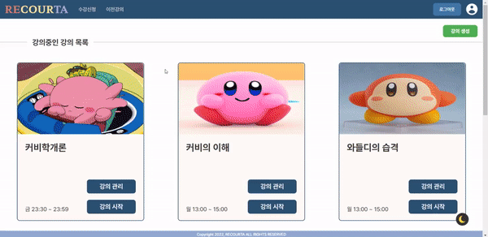

### 출결 확인

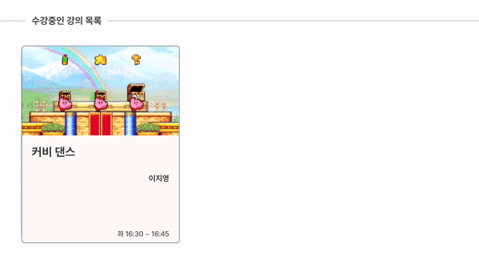

### 강의실

---

### 자막

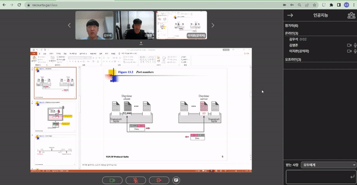

### 강의록 저장

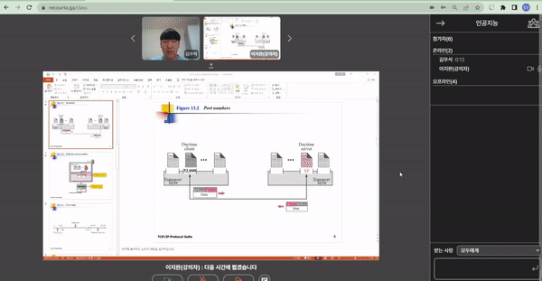

### 자리 비움

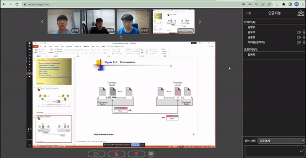

### 채팅

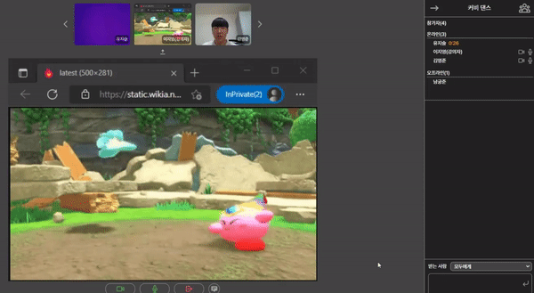

### 기타

---

### 다크 모드

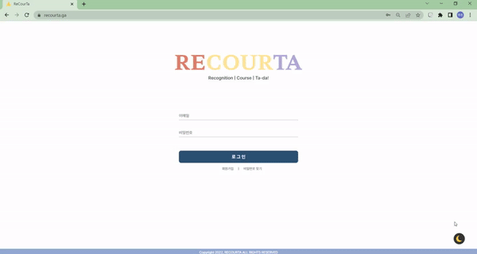

### 반응형

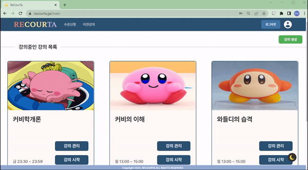

## 2. 서비스 설계

---

### 와이어 프레임 [🔗](https://docs.google.com/presentation/d/1m6u_yuLuAWC9CchZziLrvX1xOvVoWGRqdscCKHCoQhg/edit#slide=id.g13d1a5407ad_3_136)

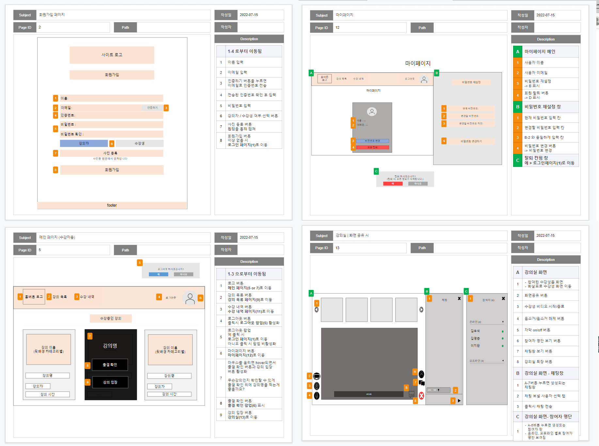

### Figma [🔗](https://www.figma.com/file/dA5ih0beSwFlgl2XlKbLUU/Recourta?node-id=0%3A1)

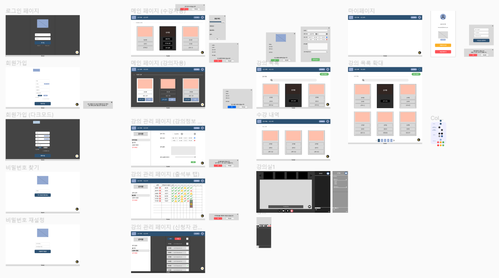

### **ERD**

# V. 협업

---

## 1. **Git**

- 노션에 Git 컨벤션을 설정하였습니다.
- 각자 맡은 기능에 맞게 `front`, `back` 브랜치를 생성하고, 완료된 기능은 `dev` 브랜치에 merge하여 사용했습니다. 배포 관련한 브랜치는 `master`를 이용하였습니다.
- 충돌 상황을 최소화하기 위해 깃 푸시를 하기 전 공유를 하였습니다.

## 2. **JIRA**

- 팀원들과의 목표 공유를 위하여, 협업 툴로 JIRA를 사용하였습니다.
- FE, BE 등의 라벨을 추가하여, 각 파트의 할 일을 한눈에 볼 수 있도록 했습니다.
- 매주 월요일 마다 백로그에 이슈들을 생성한 후 스프린트를 시작하였습니다.

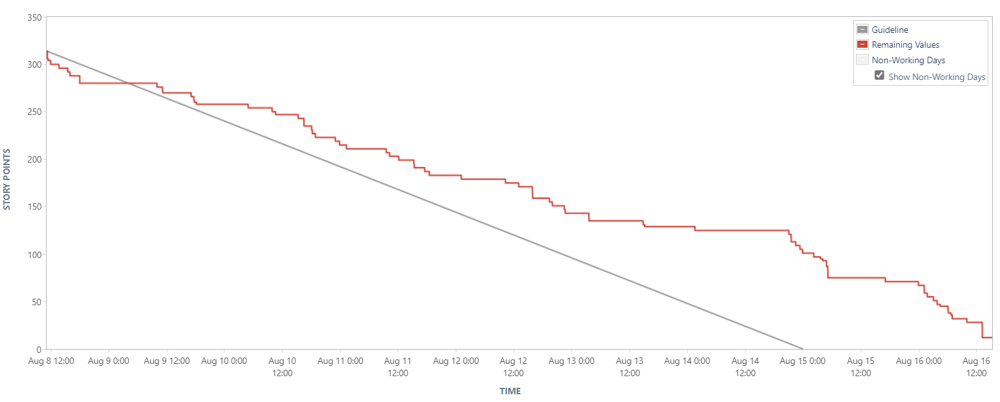

## 3. **Notion [**📎](https://www.notion.so/PJT-7-Recourta-98b5c34d3e0542a38e47132ba3e3eddf)

- 팀원들 간에 공유해야할 자료들은 노션에 백업하여 불필요한 소통을 줄였습니다.
- 프로젝트 종료 후에도 리마인드하기 쉽도록, 사용한 기술들이나 개발 과정에서 고민했던 부분들 또한 백업하였습니다.

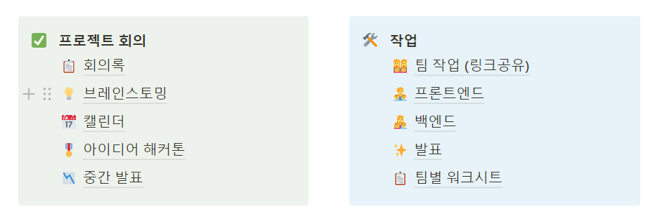

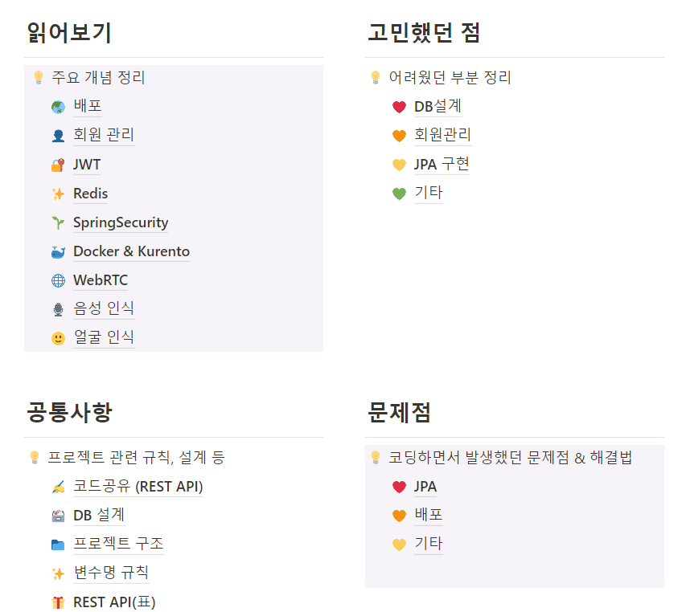

# VI. 소감

---

- **김영준** : 이번 프로젝트는 저에게는 6주라는 짧지 않은 기간동안 진행한 프로젝트였지만 순식간에 끝나버린 프로젝트이기도 했습니다. 이렇게 긴 호흡으로 진행한 프로젝트가 처음이기도 했고 팀장까지 맡아 많이 헤매고 버벅거렸지만, 항상 서로를 응원해주고 하고자 하는 의지가 넘쳤던 팀원들 덕분에 나름 만족하는 프로젝트를 완성할 수 있었습니다. 특히 백엔드와의 연동, JS를 통한 기능 구현 등 전반적인 프론트엔드 업무를 맡았기 때문에 제 개인적으로도 의미있었던 프로젝트였던 거 같습니다. 6주간 고생한 팀원들에게 너무 고맙고 더 높은 곳에서 만나길 바라겠습니다.
- **김우석** : 이번 프로젝트를 통해 협업툴인 깃 플로우 지라를 처음 사용해보았습니다. 스프린트를 통해 프로젝트 전반적으로 주차별 계획과 성과 정리등을 체계적으로 할 수 있었던 것 같습니다. 또한 이번 프로젝트를 통해 역할 분담의 장점을 아주 잘 느낄 수 있었습니다. 짧은 기간동안 원하는 결과를 내기 위해 역할을 나누어 프로젝트를 진행했고, 그 결과 기한 내에 좋은 결과물을 낼 수 있었습니다. 만난지 얼마 안된 팀원들이지만 함께한 6주동안 정말 많은 대화를 나누었고, 이를 통해 더 가까워진 것 같아서 좋았습니다. 팀원들과 미래에 높은 곳에서 만났으면 좋겠습니다.
- **남궁준** : 여러 협업 툴을 이용하면서 효과적인 소통을 위한 방법에 대하여 생각해 볼 수 있었습니다. 또한 개발 중 같은 문제를 마주했을 때에 그 문제를 분석하고, 다양한  해결법을 시도해보면서 많은 점을 배울 수 있었습니다. 단순히 개발 뿐만 아니라 기획-개발-배포의 전 과정을 진행했다는 점에서 많은 성장을 할 수 있었던 프로젝트라고 생각합니다. 6주라는 짧다면 짧다고 할 수 있는 기간동안 열정적인 팀원들과 함께 완성해낸 프로젝트이며, 앞으로의 개선 가능성에 대한 고려까지 하여 더욱 의미있게 느껴집니다.
- **유지슬** : 이번 프로젝트를 통해 협업툴-깃, 지라, 노션-을 이용하여 소통하는 방법을 배울 수 있었습니다. 특히 지라의 경우 처음 사용해봤는데, 주차 별로 할 일을 미리 정하고 작업을 하니 계획적으로 맡은 일을 끝낼 수 있었습니다. 또한 openvidu 및 JPA를 사용해보고 배포도 하면서 새로운 기술을 공부하며 성장할 수 있었습니다. 마지막으로 팀원들과 프로젝트를 진행하면서 서로 부족한 부분을 채워나간 점, 끝까지 남아있는 에러를 다같이 해결하고자 하는 열정이 좋았습니다. 팀원들과 함께해서 프로젝트를 잘 마무리 할 수 있었습니다😊.
- **이지영** : 팀원 모두가 서로의 부족한 점을 채워준다는 점에서 팀 프로젝트의 장점을 많이 느낄 수 있었습니다. openvidu처럼 처음 다뤄보는 기술도 있었고, 배포도 처음이었지만 좋은 팀원들과 함께한 덕분에 무사히 완성할 수 있었습니다. 지라, 깃, 노션같은 툴을 이용해 효율적으로 협업하는 방법 등 많은 것을 배운 프로젝트였습니다.
- **이지완** : 모두 고생하셨습니다.
