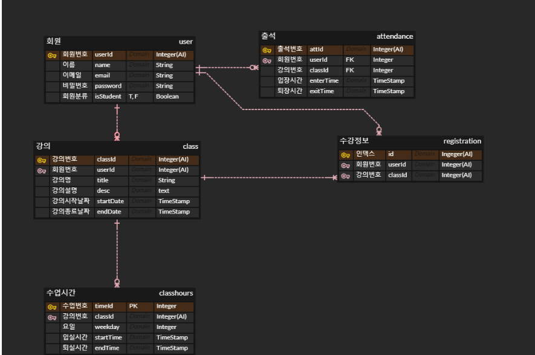

## 서울 공통 8반 A807 유지슬

- ERD 수정

- SQL문 작성
DROP DATABASE IF EXISTS ssafy_web_db;
CREATE DATABASE ssafy_web_db DEFAULT CHARACTER SET utf8mb4;

USE ssafy_web_db;

DROP TABLE IF EXISTS `user`;

CREATE TABLE `user` (
`userId`	INT AUTO_INCREMENT	NOT NULL,
`name`	VARCHAR(20)	NULL,
`email`	VARCHAR(50)	NULL,
`password`	VARCHAR(20)	NULL,
`isStudent`	TINYINT(1)	NULL	COMMENT '0 : 강의자, 1 : 학생',
`userImg`	VARCHAR(20)	NULL,

PRIMARY KEY (`userId`)
);

DROP TABLE IF EXISTS `classhours`;

CREATE TABLE `classhours` (
`timeId`	INT AUTO_INCREMENT	NOT NULL,
`classId`	INT	NOT NULL,
`startTime`	TIMESTAMP	NULL,
`endTime`	TIMESTAMP	NULL,

PRIMARY KEY (`timeId`)
);

DROP TABLE IF EXISTS `class`;

CREATE TABLE `class` (
`classId`	INT AUTO_INCREMENT	NOT NULL,
`userId`	INT	NOT NULL,
`title`	VARCHAR(50)	NULL,
`desc`	TEXT	NULL,
`startDate`	TIMESTAMP	NULL,
`endDate`	TIMESTAMP	NULL,
`classImg`	VARCHAR(20)	NULL,

PRIMARY KEY (`classId`)
);

DROP TABLE IF EXISTS `checkinout`;

CREATE TABLE `checkinout` (
`checkId`	INT AUTO_INCREMENT	NOT NULL,
`userId`	INT	NOT NULL,
`timeId`	INT	NOT NULL,
`enterTime`	TIMESTAMP	NULL,
`exitTime`	TIMESTAMP	NULL,

PRIMARY KEY (`checkId`)
);

DROP TABLE IF EXISTS `registration`;

CREATE TABLE `registration` (
`regid`	INT AUTO_INCREMENT	NOT NULL,
`userId`	INT NULL,
`classId`	INT	NOT NULL,

PRIMARY KEY (`regId`)
);

DROP TABLE IF EXISTS `attendance`;

CREATE TABLE `attendance` (
`attId`	INT AUTO_INCREMENT	NOT NULL,
`userId`	INT	NOT NULL,
`timeId`	INT	NOT NULL,
`attType`	INT	NULL	COMMENT '0 : 출석, 1 : 지각, 2 : 조퇴, 3 : 결석',

PRIMARY KEY (`attId`)
);

ALTER TABLE `classhours` ADD CONSTRAINT `FK_class_TO_classhours_1` FOREIGN KEY (
`classId`
)
REFERENCES `class` (
`classId`
)ON DELETE CASCADE;

ALTER TABLE `class` ADD CONSTRAINT `FK_user_TO_class_1` FOREIGN KEY (
`userId`
)
REFERENCES `user` (
`userId`
);

ALTER TABLE `checkinout` ADD CONSTRAINT `FK_user_TO_checkinout_1` FOREIGN KEY (
`userId`
)
REFERENCES `user` (
`userId`
);

ALTER TABLE `checkinout` ADD CONSTRAINT `FK_classhours_TO_checkinout_1` FOREIGN KEY (
`timeId`
)
REFERENCES `classhours` (
`timeId`
);

ALTER TABLE `registration` ADD CONSTRAINT `FK_user_TO_registration_1` FOREIGN KEY (
`userId`
)
REFERENCES `user` (
`userId` 
)ON DELETE SET NULL;

ALTER TABLE `registration` ADD CONSTRAINT `FK_class_TO_registration_1` FOREIGN KEY (
`classId`
)
REFERENCES `class` (
`classId`
)ON DELETE CASCADE;

ALTER TABLE `attendance` ADD CONSTRAINT `FK_user_TO_attendance_1` FOREIGN KEY (
`userId`
)
REFERENCES `user` (
`userId`
);

ALTER TABLE `attendance` ADD CONSTRAINT `FK_classhours_TO_attendance_1` FOREIGN KEY (
`timeId`
)
REFERENCES `classhours` (
`timeId`
)ON DELETE CASCADE;

SELECT * from user;
