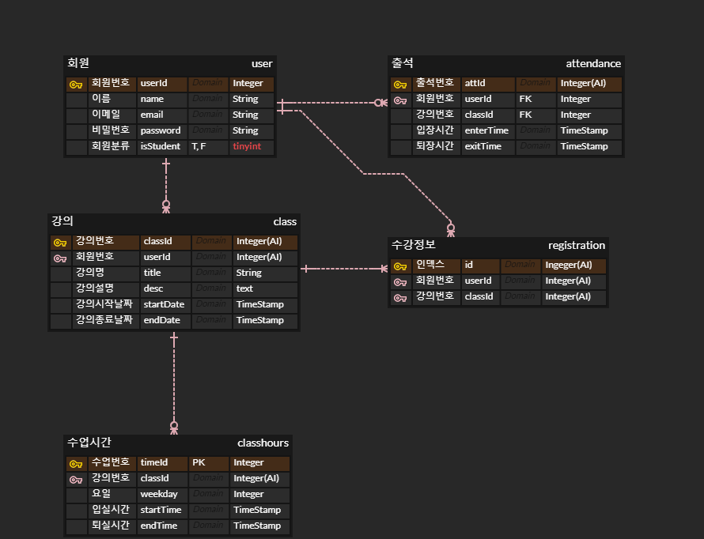

# 2022.07.14

**1. 세부 컨셉 결정**
>   - 수업 제공 플랫폼
>   - 이용 대상: 강의자, 수강생
>   - 강의자만 강의 개설 가능. 수강은 강의자, 수강생 모두 가능
>   - 정기적 수업 세션 개설
>   - 회원가입 시 필요 정보: 이름, 이메일(아이디), 비밀번호, 강의자/수강생 여부, 프로필사진(출석체크용)
>   - 로그인 페이지에서 시작 -> 로그인 한 회원만 이용가능
>   - 마이페이지: 수강중인 강좌 목록, 수강내역, 프로필
>   - 전체 강의 목록 페이지: 강의 개설(강의자만 가능), 강의 수강신청
>   - 강의실: 마이크&캠 ON/OFF, 자막 ON/OFF, 반응형 웹 적용, 채팅 기능, 참여자 목록 보기

**2. DB 설계**
>   - PK는 AUTO INCREMENT INT 인조키로 결정
>   - 강의실 입퇴장 로그는 DB에 저장. 단, 전체 레코드 개수 제한 설정
>   - 수업 회차별로 출석 체크 -> 수업 시간은 과목정보와 따로 저장
>   - 요일 정보는 0~6으로 저장(0:MON / 6:SUN)
>   - 출석 테이블은 수강생 입퇴장이 일어날 때마다 레코드가 쌓임
>   
