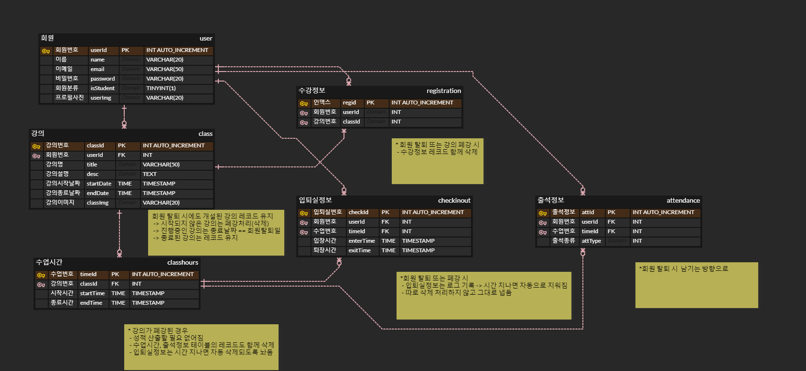

# 2022.07.15

**1. [와이어프레임](https://docs.google.com/presentation/d/1m6u_yuLuAWC9CchZziLrvX1xOvVoWGRqdscCKHCoQhg/edit#slide=id.g13d1a5407ad_6_32) 작성**

**2. 컨설턴트님께 컨펌받기**
>   - 수업시간 테이블에 요일을 저장할 필요가 있는지?
>   - 회원이 탈퇴하면 회원번호를 참조한 테이블의 레코드들은 어떻게 되는지?
>   - 로그아웃 버튼은 없는지?
>   - 개별 강의 썸네일에 기본 이미지가 있었으면 좋겠음

**3. 피드백 내용 바탕으로 와이어프레임 & DB설계 수정 후 SQL문 작성**
>   - 
